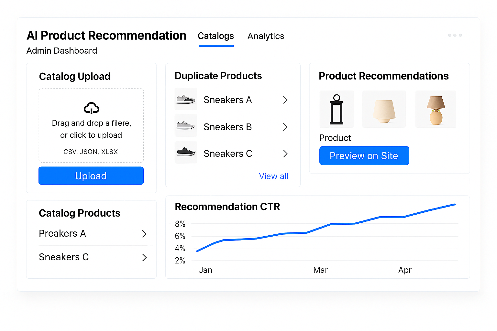
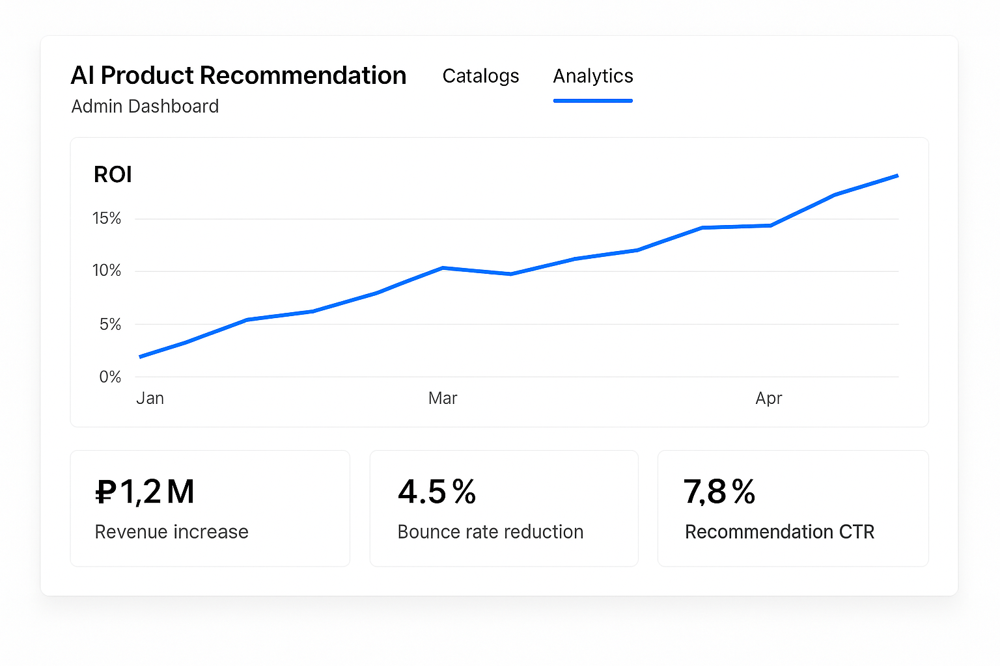

# 📝 Описание прототипа продукта

!!! В рамках первой итерации оставил комментарии в формате `P.S.: ...`, по которым хотел бы получить ответ!!!

## Шаг 1: Какую задачу решает ваш продукт?
Мультимодальная система рекомендаций на основе CLIP-подобной архитектуры решает проблему дублирования товаров и нерелевантных рекомендаций в e-commerce. Она объединяет изображение и описание товара в единое векторное представление, улучшая качество рекомендаций и пользовательский опыт.

## Шаг 2: Кто является целевым пользователем?
**B2B:**
- Крупные маркетплейсы (например, Ozon, Wildberries)\
`P.S.: Сомневаюсь, что у самых крупных игроков нет такого`
- Интернет-магазины среднего размера\
`P.S.: А вот с этого сегмента считаю решение может стать релевантным`
- Мелкие дистрибьюторы с онлайн-каталогами

## Шаг 3: Какую ценность продукт приносит ЦА?
- Повышение конверсии (на 15–45%) и среднего чека (до 25%) за счёт более точных рекомендаций  
- Устранение дубликатов товаров и повышение качества каталога  
- Снижение затрат на ручную модерацию

_Метрика оценки:_ ROI от внедрения, прирост выручки от рекомендательного блока, снижение процента отказов, рост CTR в рекомендательных блоках

## Шаг 4: Чем ваш продукт лучше альтернативных решений?
- Использует мультимодальные эмбеддинги (текст + изображение) в отличие от rule-based или только текстовых решений\
`P.S.: Опять же повторюсь, мне кажется, у крупных игроков это уже есть, в отличие от других 2 когорт ЦА (представленных выше)`
- Способен выявлять дубли на основе семантики и визуальной схожести  
- Гибко масштабируется и легко интегрируется в существующую инфраструктуру

## Шаг 5: Как пользователь взаимодействует с продуктом?
Взаимодействие происходит через API. Сторона клиента (например, маркетплейс) отправляет данные о товарах (описания и изображения), а система возвращает рекомендации или выявленные дубликаты. Поддерживается batch-обработка и доступ через облачный интерфейс.

Пример UI на этапе MVP/пилота:
 

## Шаг 6: Как пользователь узнает о продукте?
- Партнерские предложения и интеграции с крупными e-commerce платформами  
- Участие в отраслевых мероприятиях (напр. DataFest, Ecom Conf)  
- Цифровой маркетинг: статьи на VC.ru, Telegram, профильные чаты  
- Бесплатные пилотные проекты и open-demo доступ

## Шаг 7: Какая бизнес-модель будет у продукта?
`P.S.: Расположил в порядке указания ЦА в пункет выше: от наиболее крупного к наименее крупному игроку`
- Лицензирование и кастомизация для enterprise-сегмента
- SaaS подписка для SMB (фиксированные тарифы)
- Pay-as-you-go (по числу рекомендаций или SKU)
- Freemium-режим на ограниченное количество товаров для теста

## 📌 Финальное описание продукта (позиционирование):
**Мы, компания AI FromRussiaWithRecs,**  
**помогаем клиентам типа B2B e-commerce платформ**  
**в ситуации сложного управления каталогом и дублирующихся товаров**  
**решать проблему повышения качества рекомендаций и устранения дублей**  
**с помощью технологии мультимодальных эмбеддингов на основе CLIP**  
**и получать ценность в виде роста конверсии, экономии ресурсов и улучшения UX.**
